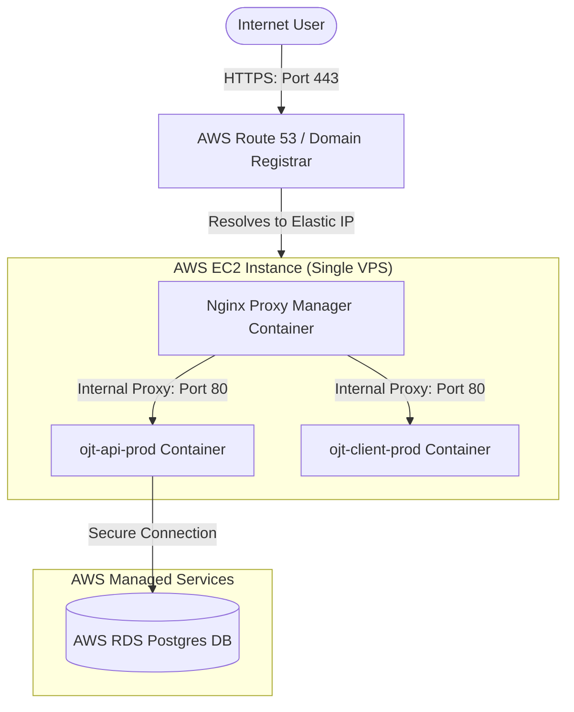

# AWS Hosting & Deployment Guide

This guide details how to deploy your Laravel API and Expo Web Client on a single **AWS EC2 (VPS)** instance, connect to an **AWS RDS (Postgres)** database, set up your custom domain, and secure everything using **Nginx Proxy Manager (NPM)**.

---

## 🏗️ Architecture Overview



---

## 1. 🐘 Database Setup: AWS RDS (PostgreSQL)

Rather than hosting the database inside Docker on your VPS, we use AWS RDS for high availability, automatic backups, and security.

1. **Create an RDS Database:**
   * Go to AWS RDS Dashboard -> **Create Database**.
   * Choose **PostgreSQL** (version 16 or matching local setup).
   * Templates: Select **Free Tier** or **Production** based on budget.
   * Settings: Enter DB Instance identifier, Master Username (e.g. `root`), and a secure Master Password.
2. **Network & Connectivity Configuration:**
   * **VPC**: Place it in the same VPC as your EC2 instance.
   * **Public Access**: Select **No** (we want it private and secure, accessible only from the EC2 instance).
   * **VPC Security Group**: Create a new Security Group (e.g., `rds-sg`).
3. **Database Security Group Rule:**
   * Go to the Security Group (`rds-sg`) configuration on EC2/VPC console.
   * **Inbound Rule**: Allow PostgreSQL traffic (port `5432`) only from the Security Group of your EC2 instance (`ec2-sg`). **Never allow `0.0.0.0/0`!**

---

## 2. 🖥️ VPS Setup: AWS EC2 (Single VPS)

1. **Launch an EC2 Instance:**
   * Choose **Ubuntu 24.04 LTS** (t3.micro or t3.small is ideal to start).
   * Create or select a key pair (`.pem`) for SSH access.
   * **Security Group (`ec2-sg`)**: Allow inbound ports:
     * `22` (SSH) — limit to your IP address.
     * `80` (HTTP) — open to `0.0.0.0/0`.
     * `443` (HTTPS) — open to `0.0.0.0/0`.
     * `81` (NPM Admin Panel) — limit access to your IP address for security.
2. **Assign an Elastic IP:**
   * Go to **Elastic IPs** -> **Allocate Elastic IP**.
   * Associate this permanent public IP with your EC2 instance so that your IP does not change when rebooting the instance.

---

## 3. 🌐 Domain Setup

1. **DNS Records Configuration:**
   * Go to your domain registrar (e.g., AWS Route 53, GoDaddy, Namecheap).
   * Create two **A Records** pointing to your **AWS Elastic IP**:
     * `attendance.yourdomain.com` (Frontend Client) -> Points to VPS Elastic IP.
     * `api.attendance.yourdomain.com` (Backend API) -> Points to VPS Elastic IP.

---

## 4. 🐋 Docker & Nginx Proxy Manager Setup on EC2

Log into your EC2 instance via SSH:
```bash
ssh -i "your-key.pem" ubuntu@your-elastic-ip
```

### Install Docker & Git:
```bash
sudo apt update
sudo apt install -y docker.io docker-compose git
sudo usermod -aG docker $USER
newgrp docker
```

### Deploy Nginx Proxy Manager (NPM):
If you do not already have NPM running on this VPS, spin it up using a simple Docker Compose file:
```yaml
# docker-compose.yml for NPM
version: '3.8'
services:
  app:
    image: 'jc21/nginx-proxy-manager:latest'
    restart: unless-stopped
    ports:
      - '80:80'
      - '81:81'
      - '443:443'
    volumes:
      - ./data:/data
      - ./letsencrypt:/etc/letsencrypt
    networks:
      - npm_default

networks:
  npm_default:
    name: npm_default
```
Launch it: `docker compose up -d`.

---

## 5. 🚀 Deploying the Attendance Stack

1. **Clone your project** to the EC2 instance.
2. **Configure your Database Credentials**:
   * Set your database credentials using environment variables or a `.env` file inside the `api/` folder.
   * **`DB_HOST`**: Use the AWS RDS Endpoint (e.g. `ojt-db.xxxxxx.us-east-1.rds.amazonaws.com`).
   * **`DB_DATABASE`**, **`DB_USERNAME`**, **`DB_PASSWORD`**: Match your RDS settings.
3. **Spin up the stack**:
   ```bash
   # Run from the root of the project
   DB_HOST="your-rds-endpoint" \
   DB_DATABASE="api" \
   DB_USERNAME="root" \
   DB_PASSWORD="your-rds-password" \
   ./manage.sh prod-up
   ```
   *Your containers will start up silently and join the `npm_default` network.*

---

## 6. 🔒 Routing Traffic through Nginx Proxy Manager

1. Open your browser and go to your NPM Admin Panel: `http://your-elastic-ip:81`
   * *Default credentials: Username `admin@example.com`, Password `changeme`.*
2. Add a **Proxy Host** for the **Client (Frontend)**:
   * **Domain Name**: `attendance.yourdomain.com`
   * **Forward Hostname**: `ojt-client-prod` (Docker handles routing internally!)
   * **Forward Port**: `80`
   * Under the **SSL** tab:
     * Select **Request a new SSL Certificate**.
     * Enable **Force SSL** and accept Let's Encrypt Terms.
3. Add a **Proxy Host** for the **API (Backend)**:
   * **Domain Name**: `api.attendance.yourdomain.com`
   * **Forward Hostname**: `ojt-api-prod`
   * **Forward Port**: `80` (Laravel production image serves on port 80 internally)
   * Under the **SSL** tab:
     * Select **Request a new SSL Certificate**.
     * Enable **Force SSL**.

Your application is now fully live, highly secure behind Nginx Proxy Manager with automated SSL, and backed by a robust AWS RDS cloud database!
